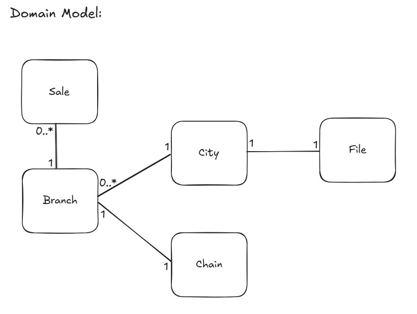

# Specification – "Burger Sales - Leaderboard"  
*(Implemented with Multi-Threading)*

**By Gili Wolf**  
**February - 2025**

---

## Overview

### Requirements
The “Burger Leaderboard” is an initiative to find the store or franchise with the most burger sales. Once a year, all the sales from all the branches are evaluated and the “King of Burger Sales” is announced. The business requirement is: **Develop a system that can take all the sales files from all the branches in all the cities and find the chain that sold the most burgers that year.**

**Explanation:**  
- Each file describes exactly one city.
- Each city contains multiple branches, but a branch can only be in one city.
- Each branch belongs to one chain.
- A chain can contain multiple branches.
- There is **NO** direct relationship between the concept of chain and the concept of city.
- Each sale belongs to one and only one branch. A branch can have multiple sales.

For each city, a file is produced listing the hamburger purchases in that city, with each purchase recorded as the chain’s name, separated by “, ” (comma and space).

_Example:_  
burger king, burger king, McDonalds

If a sale includes multiple burgers, there will be multiple entries in the file.

- **Input:** A directory of files that describe the sales. One file per city in the format above. The name of the file is the name of the city.
- **Output:** The system outputs a single winning chain with the highest total sales (ties are broken arbitrarily).

---

## Constraints & Assumptions

- The system handles up to **1020 cities** (i.e., up to 1020 files).
- Each file can contain up to **1024 distinct hamburger chains**.
- No `", "` substring appears inside a chain’s name.
- A chain's name can have spaces and other alphanumeric characters.
- A city cannot have 0 sales. If there were no sales that year, the city file does not show in the directory.
- A branch can have 0 sales for that year.
- The name of the branch must be exactly the same in all appearances in all files.
- Files do not change during processing (batch mode).

### Performance Requirement
The system must complete within **one minute**.

---

## Implementation

Due to the need for low return times, we decided to implement the system as a multi-threaded system.  
This specification describes the multi-threaded implementation.

A default **5-second timeout** is used for detecting stuck threads or files (configurable as needed).

**Technical Requirement:**  
This system is designed for parallel (multi-threaded) processing of hamburger sales data across multiple cities. The system’s goal is to merge all data and identify which hamburger chain achieved the highest sales nationwide over a certain time period, and to return the result in under 1 minute.

---

## Technical Considerations

- **Parallel Execution (Multi-threading):** Maximize CPU utilization by concurrently processing multiple files.
- **Fault Tolerance:** Implement a monitoring mechanism to detect and recover from worker failures or delays, ensuring that all files are eventually processed.
- **Result Aggregation:** Efficiently merge partial results from all files into a single data structure to identify the top-selling chain.

---

## Architecture & High-Level Flow

### Key Data Structures
- **task_queue (Queue of file paths):**  
  A FIFO queue containing the file paths awaiting processing.
- **task_status (Dictionary):**  
  Tracks each file’s status (`pending`, `in_progress`, `done`) along with a timestamp marking when it entered its current state.
- **global_results (List of Hash Tables):**  
  Stores the local counts of each hamburger chain from every file processed.

### Threads
- **Worker Threads:**  
  - Dequeue a file path from `task_queue`.
  - Mark the file as `in_progress` in `task_status`, including a timestamp.
  - Process the file’s contents (count how many times each chain appears).
  - Mark the file as `done` in `task_status` and append the local hash table to `global_results`.
- **Monitor Thread:**  
  - Periodically scans `task_status` (e.g., every second).
  - Identifies files that have remained in `in_progress` longer than a specified timeout.
  - Resets those files to `pending` and pushes them back into `task_queue`.

### Result Merging & Final Output
- Once all files are processed, the system merges the hash tables in `global_results` into one dictionary.
- It then determines which chain has the highest sales and displays that chain as the winner.

---

## Workflow

### Initialization
- The main program reads the list of files from a data directory.
- It populates `task_queue` with these file paths and initializes `task_status` (all files start in `pending`).
- It sets up an empty list `global_results` to collect the partial counts from each file.

### Parallel Execution
- A number of Worker Threads are created (up to 1020, or fewer if there are fewer files).
- Each worker fetches a file from `task_queue`, updates its status, processes it, and then appends the result to `global_results`.
- Simultaneously, the Monitor Thread scans `task_status` to detect and reassign files stuck in `in_progress` beyond the timeout threshold.

### Completion & Aggregation
- After all files are processed (when `task_queue` is empty and all files are marked `done`), the threads finish execution.
- The main program merges all local hash tables in `global_results` into a single dictionary.
- It identifies the top-selling hamburger chain and prints the result.

---

## System Components

- **main.py File:**  
  - Holds the global configurations, main functions, and the main entry point.
  - Initializes data structures, spawns threads, and coordinates final output.
- **data Directory:**  
  - Contains the city files (e.g., `TelAviv.txt`, `Jerusalem.txt`) with chain names separated by “, ”.
- **Worker Threads & Monitor Thread:**  
  - Implemented using Python’s `threading.Thread`.
  - Workers handle parallel file processing; the Monitor checks for and resolves timeouts.
- **Timeout Mechanism:**  
  - Prevents files from remaining indefinitely in `in_progress` if a worker hangs or crashes.
  - Moves stuck files back to `pending` status in the queue.

---

## Expected Outcomes

- The system outputs a single winning chain with the highest total sales (ties are broken arbitrarily).
- Parallel processing reduces overall runtime compared to a single-threaded approach.
- The Monitor Thread automatically handles failures by reassigning files when a worker crashes or times out.

---

## Future Extensions & Optimizations

- Use more advanced storage formats (e.g., Parquet) for large-scale data.
- Employ distributed processing frameworks (Spark, Dask) for even greater scalability.
- Implement a cancellation mechanism to handle worker threads that exceed the timeout but do not crash.
- Remove completed files from `task_status` to reduce overhead when the number of files is very large.

---

This specification provides an overview of the system architecture, the data structures involved, and the processes that ensure reliable, concurrent, and efficient handling of hamburger sales data.

